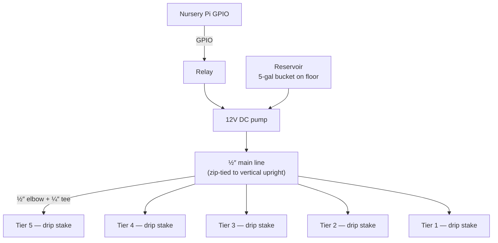

> Indoor seed-starting nursery for [[Garden Monitor]] — drip irrigation, sensor wiring, camera, and tier strategy for the SOLIGT 5-tier greenhouse on the [[Raspberry Pi 5]] / older Pi node.

## Hardware (Owned + Purchased)

- **SOLIGT 5-tier greenhouse** — 63" tall, includes lights, timer, hygrometer, PVC cover. All-in-one nursery shelf.
- **Trifecta Myco Supreme** — mycorrhizal fungi for transplant.
- **Miracle-Gro potting soil** — but **don't combine with Myco Supreme** (high phosphorus kills the beneficial fungi).
- 2 × [[Capacitive Soil Moisture Sensor]] (Gikfun, already on hand).

## Components to Add (~$50–70)

| Item | Search term | Approx. cost |
|---|---|---|
| 12V DC submersible pump (240 L/H, 3m head) | `SIPYTOPF DC 12V submersible pump 240L/H 3M head` | ~$7 |
| 12V 2A DC power adapter | | ~$9 |
| Adjustable drip emitters (50-pack) | `MIXC 50pcs drip emitters fan stake 1/4 inch` | ~$8 |
| ADS1115 16-bit I2C ADC | `HiLetgo ADS1115 16 bit I2C` | ~$6 |
| 5-pack Gikfun capacitive moisture sensors | (same brand as already owned) | ~$8 |
| 4-channel relay module | | ~$6 |
| DHT22 temp/humidity sensor | | ~$6 |
| Jumper wires kit | | ~$7 |
| Pi Camera Module (OV5647 IR-Cut, 5 MP) | `Aokin Raspberry Pi camera IR-Cut OV5647 5MP` | ~$12 |

**Total nursery system investment:** ~$310–340 all-in including the SOLIGT shelf.

## 1. Pump Sizing

The shelf is 63" tall (~5.3 ft). Pump must push water from a floor reservoir up to the top tier.

- **Head height** is the key spec — get a pump rated for **6–10 ft of head** for comfortable margin.
- **Flow rate matters less** here — drip, not flood. **80–120 GPH at 5 ft head** is plenty.
- 12V DC submersible is preferred over USB — switchable via relay from the nursery Pi's GPIO for [[Garden Monitor]] automation integration.

## 2. Plumbing Layout

- **½" main tubing (50 ft kit)** runs vertically up the back of the shelf.
- **½" elbow fittings (La Farah)** turn the line horizontal at each tier.
- **½"-to-¼" barbed tees (Kalolary)** tap off at each tray position.
- **¼" distribution tubing (Hourleey 50 ft)** goes from each tee to a drip stake.
- **Adjustable drip emitters (~$8 / 50-pack)** at the end of each ¼" line — dial flow per tray. Lettuce needs less than peppers.
- **End cap** the ½" main line at the top (or fold-and-clamp).
- **PVC liners** that come with the shelf catch drainage on each tier; can drip back down to the reservoir (closed loop) or into separate trays.

## 3. Moisture Sensor Architecture

- Older Raspberry Pis have **no analog input** — capacitive sensors are analog, so we need an **ADS1115 16-bit ADC over I2C**.
- ADS1115 gives 4 analog channels — enough for one sensor per tier on tiers 1–4. Tier 5 either shares with tier 4 or daisy-chains a second ADS1115.
- Each sensor pushes into the soil of a representative tray on its tier.
- Pi reads moisture every 30 seconds via I2C, publishes to MQTT topics like `garden/nursery/tier1/moisture`.
- Hub evaluates threshold; pump relay fires for 10–15 seconds (calibrate from there).
- **Phase 2 upgrade:** Add a small solenoid valve on each tier's ½" branch line, individually relay-controlled. Then we can water tier 3 (peppers) without watering tier 1 (lettuce that's already moist).

## 4. Camera Integration

- **Pi Camera Module (OV5647)** mounted on the **top tier looking down** — captures tiers 1–3 from above.
- Connects via CSI ribbon cable directly to the nursery Pi.
- Schedule: capture every 4–6 hours. Generate timelapse via `raspistill` / `libcamera`.
- One camera can't see all 5 tiers usefully — for full coverage, add a second on the bottom tier looking up, or build a motorized vertical slide rail (fun future project with a stepper + Arduino).
- The [[Arduino Nicla Vision]] is **better used outdoors** where its edge ML and standalone WiFi shine.

## 5. Tier Layout Strategy

Heat rises naturally inside the PVC enclosure — exploit this for free temperature zoning instead of buying a second heat mat:

| Tier | Temp zone | Best for |
|---|---|---|
| **Top (5/4)** | Warmest (75–85°F) | Tomatoes, peppers, jalapeños, basil, watermelon |
| **Middle (3/2)** | Moderate | Onions, oregano, rosemary, broccoli |
| **Bottom (1)** | Coolest | Lettuce, cilantro (lettuce won't germinate above 75°F) |

## Build Phases

- **Phase 1 (now):** Pump + reservoir + ½" main + drip emitters wired manually. Sensor on one tier feeding to nursery Pi via ADS1115. MQTT publishing.
- **Phase 2:** Per-tier solenoid valves for selective watering. DHT22 humidity tracking. Pi Camera with scheduled capture.
- **Phase 3:** Plant health ML inference from camera feed. Integrated dashboard with [[Outdoor Watering System]].

---

**Links:** [[Garden Monitor]] · [[Indoor Nursery]] · [[Outdoor Watering System]] · [[Capacitive Soil Moisture Sensor]] · [[Arduino Nicla Vision]] · [[Hardware Inventory]]

#garden-monitor #architecture #nursery #irrigation #automation
