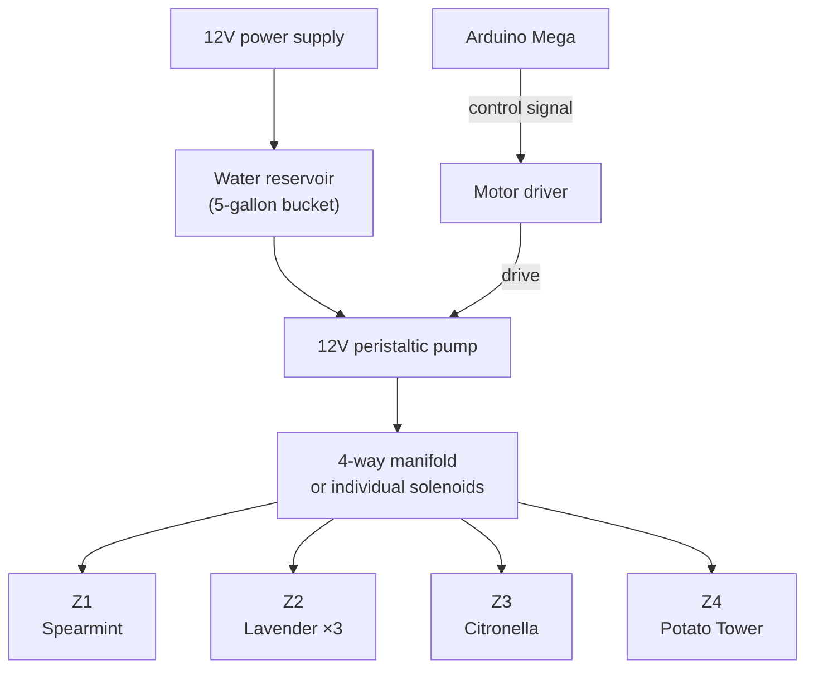

> Detailed system design for automated watering of 4 plant zones on the south side of the house in Houston, TX.
> Part of the [[Garden Monitor]] project · See also [[System Architecture]]

---

## Site Overview

- **Location:** South side of house, Houston TX (USDA Zone 9a)
- **Sun exposure:** ~6–7 hours direct sun per day
- **Climate:** Hot, humid subtropical — summers routinely 95–100°F with high humidity
- **Key challenge:** Houston heat + humidity means plants can cook if overwatered (wet foliage + heat = fungal death), but potted plants dry out fast in direct sun

---

## The 4 Zones

### Zone 1 — Spearmint (1 plant, single pot)

**Watering profile:** HIGH moisture demand
- Mint needs consistently moist soil — it wilts visibly when thirsty but rebounds fast
- In Houston summer heat, potted mint may need watering **daily or every other day**
- In scorching Texas summers, mint often goes into "hibernation" and looks rough — it'll come back when temps cool
- Water at the base, keep foliage dry to prevent fungal issues (rust is common on mint in Houston)
- Let the top inch dry between waterings, but don't let it go bone dry

**Sensor strategy:** 1 × [[Capacitive Soil Moisture Sensor]]
**Threshold:** Water when reading drops below "moist soil" calibration (~350–400 range, TBD after calibration)
**Watering duration:** Short burst — 10–15 seconds of pump flow, then wait and re-check
**Special notes:**
- Mulch the pot to reduce evaporation
- Consider afternoon shade if plant struggles in peak summer
- Spearmint in a pot in Houston = daily water monitoring is critical

---

### Zone 2 — Lavender (3 plants, rectangle pot)

**Watering profile:** LOW moisture demand — the opposite of mint
- Lavender is Mediterranean — it wants to be **dry** between waterings
- In Houston's humidity, lavender is more likely to die from overwatering than underwatering
- Water deeply but **infrequently** — once a week at most when established, maybe less
- The saying from Texas lavender growers: "If you think it needs water, wait until tomorrow"
- Water at the base ONLY — wet foliage + Houston humidity = black leaves and death
- Mulch with gravel or expanded shale (NOT organic mulch) to keep lower foliage dry and reflect heat
- Excellent drainage is absolutely critical — the rectangle pot needs drainage holes and fast-draining soil mix (sand/perlite heavy)

**Sensor strategy:** 1 × [[Capacitive Soil Moisture Sensor]] (shared across the rectangle pot)
**Threshold:** Water ONLY when reading drops well into "dry soil" range (~450–500+, TBD)
**Watering duration:** Deep soak — 20–30 seconds of pump flow, then don't water again for days
**Cooldown period:** **Minimum 4–5 days between waterings**, enforced in firmware
**Special notes:**
- Best lavender varieties for Houston: Sweet Lavender, Fern Leaf, or French/Spanish types
- Don't expect lavender to last more than 2–3 years in Houston — it's not their climate
- Don't over-fertilize — lavender likes lean soil
- ⚠️ This zone needs the OPPOSITE logic from mint — the system must prevent accidental overwatering

---

### Zone 3 — Citronella (1 plant, single pot)

**Watering profile:** MODERATE moisture demand
- Citronella (scented geranium / Pelargonium citrosum) is drought-tolerant but appreciates regular moisture
- Water when the top inch of soil is dry — roughly every 2–3 days in Houston summer
- Good drainage is essential — citronella gets root rot from standing water
- Can handle Houston's heat and humidity reasonably well
- Benefits from afternoon shade in peak summer
- Fertilize container-grown citronella biweekly during growing season

**Sensor strategy:** Share sensor data with Zone 1 OR dedicate a sensor if budget allows (we only have 2 sensors currently — see [Sensor Allocation](#sensor-allocation) below)
**Threshold:** Water when reading drops to "moderately dry" range (~400–440, TBD)
**Watering duration:** Medium — 12–18 seconds of pump flow
**Special notes:**
- Citronella is toxic to pets — placement matters if dogs/cats are around
- Pinch tips regularly for bushier, more fragrant growth
- Bring indoors before first frost (typically late November in Houston)

---

### Zone 4 — Potato Tower

**Watering profile:** HIGH moisture demand — consistent moisture is critical
- Potatoes need 1–2 inches of water per week, steadily applied
- During tuber formation (6–8 weeks after planting), increase to watering every 1–2 days
- A potato tower dries out faster than ground planting — the elevated, exposed soil loses moisture quickly
- Drip irrigation or a PVC pipe inserted into the tower for deep watering works best
- Water at the base — overhead watering in Houston heat = fungal disaster
- Stop watering when vines yellow and die back (curing phase, ~2 weeks before harvest)

**⚠️ CRITICAL WARNING FOR HOUSTON:**
- Research shows that when soil temperature exceeds 75°F (24°C), potato plants stop forming tubers
- Houston summer soil temps easily hit 90°F+ in direct sun
- **Potato tower growing season in Houston is SHORT: plant in January–February, harvest by May before the heat**
- If planting now (March), you're on the edge — monitor soil temp closely
- Consider a fall planting (late August/September) for a second crop

**Sensor strategy:** This zone has the most to gain from a dedicated soil moisture sensor
**Threshold:** Keep soil consistently in "moist" range (~280–380) — potatoes hate drying out
**Watering duration:** Long, slow soak — 25–40 seconds via pump, or PVC drip method
**Special notes:**
- Insert a PVC pipe with holes into the tower center for even water distribution
- Mulch the top heavily with straw
- Consider adding a soil temperature sensor (DHT22 or DS18B20) to monitor heat stress
- If soil temp > 75°F consistently, potatoes won't produce — consider shade cloth

---

## Sensor Allocation

We currently have **2 × [[Capacitive Soil Moisture Sensor]]**. With 4 zones that have very different watering needs, here's the recommended allocation:

| Sensor | Assigned Zone | Rationale |
|--------|--------------|-----------|
| Sensor 1 | Zone 2 — Lavender | Most critical to NOT overwater — sensor prevents killing them |
| Sensor 2 | Zone 4 — Potato Tower | Most critical to keep consistently moist — highest production value |

**Zones 1 & 3 (Mint & Citronella)** — these are more forgiving plants. For now:
- Run on a **time-based schedule** (daily for mint, every 2–3 days for citronella)
- Both visibly wilt when thirsty and recover quickly — manual override is easy
- **Phase 2:** Purchase 2 more capacitive soil moisture sensors (~$5–8 for a pack) and give every zone its own sensor

---

## Irrigation Hardware Design



### Option A: Single Pump + Solenoid Valves (Recommended)
- 1 × 12V peristaltic pump (precise volume control)
- 4 × 12V normally-closed solenoid valves (one per zone)
- Arduino Mega opens the correct valve, then runs the pump for the zone's duration
- Only one zone waters at a time — simpler control logic

### Option B: Single Pump + Manual Splitter
- 1 × pump feeds a 4-way drip irrigation manifold with manual flow adjusters
- Less precise but simpler wiring
- Can't target individual zones automatically

### Option C: 4 Individual Small Pumps
- One pump per zone — most flexible, but more wiring and power draw
- Could use the motor driver's 2 channels + additional relay for remaining 2

**Recommendation:** Option A — gives per-zone control with minimal hardware. The solenoid valves are cheap ($3–5 each on Amazon) and the Mega has plenty of digital pins.

---

## Watering Logic (Firmware)

```
LOOP (every 5 minutes):
  
  FOR each zone:
    READ soil_moisture (if sensor assigned)
    READ ambient_temp, humidity (from Nicla Sense Env)
    
    IF zone has sensor:
      IF soil_moisture < zone.dry_threshold:
        IF time_since_last_water > zone.min_cooldown:
          ACTIVATE pump for zone.duration seconds
          LOG event to Pi 5
    
    ELSE (time-based zones):
      IF current_time matches zone.schedule:
        IF time_since_last_water > zone.min_cooldown:
          ACTIVATE pump for zone.duration seconds
          LOG event to Pi 5
  
  SEND all sensor data to Pi 5 via serial (JSON)
  
  SAFETY CHECKS:
    - Max daily water limit per zone (prevent runaway pump)
    - Pump timeout (never run > 60 seconds continuously)
    - If ambient temp > 100°F, delay watering until evening
    - Rain detection (future: add rain sensor)
```

### Per-Zone Configuration

| Parameter | Zone 1 (Mint) | Zone 2 (Lavender) | Zone 3 (Citronella) | Zone 4 (Potato) |
|-----------|--------------|-------------------|--------------------|-----------------| 
| Sensor | None (Phase 1) | Sensor 1 | None (Phase 1) | Sensor 2 |
| Trigger | Schedule: 7 AM daily | Moisture < dry threshold | Schedule: 7 AM every 2 days | Moisture < moist threshold |
| Pump duration | 12 sec | 25 sec (deep soak) | 15 sec | 35 sec (slow soak) |
| Min cooldown | 12 hours | 5 days | 2 days | 12 hours |
| Max daily water events | 2 | 1 | 1 | 2 |
| Preferred time | Early morning (7 AM) | Early morning (7 AM) | Early morning (7 AM) | Early morning (7 AM) |

**Why 7 AM?** In Houston, morning watering lets the soil absorb before peak heat. Evening watering in Houston's humidity can leave foliage wet overnight → fungal problems.

---

## Environmental Monitoring

The [[Arduino Nicla Sense Env]] provides context that makes watering smarter:

| Reading | Use |
|---------|-----|
| Temperature | If > 100°F, delay watering to evening. If potato soil temp > 75°F, alert. |
| Humidity | If > 85% humidity, extend lavender cooldown (less evaporation = less need). |
| Air quality (VOC/gas) | Baseline data — interesting but not critical for watering. |

**Future addition:** A **DS18B20 waterproof temperature probe** stuck into the potato tower soil would give direct soil temperature readings — critical for knowing if tubers are still forming.

---

## Physical Layout

```
            SOUTH WALL OF HOUSE
  ┌─────────────────────────────────────┐
  │                                     │
  │  ☀️ 6-7 hrs direct sun per day ☀️    │
  │                                     │
  │  ┌─────┐  ┌─────────────┐          │
  │  │ Z1  │  │    Z2       │          │
  │  │Mint │  │  Lavender   │          │
  │  │ pot │  │  rect. pot  │          │
  │  └──┬──┘  └──────┬──────┘          │
  │     │             │                 │
  │  ┌──┴──┐  ┌──────┴──────┐          │
  │  │ Z3  │  │    Z4       │          │
  │  │Citro│  │  Potato     │          │
  │  │ pot │  │  Tower      │          │
  │  └─────┘  └─────────────┘          │
  │                                     │
  │  ┌──────────────────┐              │
  │  │ Electronics Box  │ (weatherproof)│
  │  │ Arduino Mega     │              │
  │  │ Motor Driver     │              │
  │  │ Nicla Sense Env  │              │
  │  │ Solenoid Valves  │              │
  │  └────────┬─────────┘              │
  │           │ USB cable (shielded)    │
  │           ▼                         │
  │  ┌──────────────────┐              │
  │  │ Water Reservoir  │              │
  │  │ (5 gal bucket    │              │
  │  │  with lid)       │              │
  │  └──────────────────┘              │
  │                                     │
  └─────────────────────────────────────┘
          │
          │ USB cable to indoor Pi 5
          ▼
  ┌──────────────────┐
  │  Raspberry Pi 5  │  (INDOORS, near window/wall)
  │  + ESP 5" Display│
  └──────────────────┘
```

---

## Power Plan

| Component | Power | Notes |
|-----------|-------|-------|
| Arduino Mega | 5V USB from Pi 5 (or wall adapter) | ~200 mA |
| 12V Pump | 12V DC wall adapter | ~800 mA–1.5 A depending on pump |
| Solenoid valves × 4 | 12V (shared with pump supply) | ~300 mA each, only 1 active at a time |
| Motor driver (L298N) | 12V input + 5V logic from Mega | |
| Nicla Sense Env | 3.3V from Mega I2C bus | Ultra-low power |
| Soil moisture sensors × 2 | 3.3–5V from Mega | Negligible draw |

**Total outdoor power:** One 12V 3A DC adapter covers the pump + valves. A separate 5V USB adapter (or USB from Pi) powers the Mega.

**Weatherproofing:** All electronics go in an IP65 weatherproof junction box mounted on the house wall. Sensor cables run out through cable glands. The reservoir sits at ground level with a lid to prevent debris/mosquitoes.

---

## Shopping List (What's Still Needed)

| Item | Est. Price | Priority |
|------|-----------|----------|
| 12V peristaltic pump | $8–15 | 🔴 Must have |
| 12V solenoid valves × 4 | $12–20 (pack) | 🔴 Must have |
| Silicone tubing (¼" ID) | $8–10 | 🔴 Must have |
| 4-way drip manifold / T-connectors | $5–8 | 🔴 Must have |
| IP65 weatherproof electronics box | $10–15 | 🔴 Must have |
| 12V 3A DC power adapter | $8–12 | 🔴 Must have |
| Water reservoir (5 gal bucket w/ lid) | $5 | 🔴 Must have |
| Cable glands (assorted) | $6–8 | 🟡 Important |
| 2 × additional soil moisture sensors | $6–8 | 🟡 Phase 2 |
| DS18B20 waterproof temp probe | $3–5 | 🟡 Phase 2 (potato) |
| Relay module (4-channel, if not using motor driver for valves) | $5–8 | 🟡 Depends on design |
| Rain sensor module | $3–5 | 🟢 Nice to have |
| Jumper wires, breadboard | $5–10 | 🔴 Must have |

**Estimated total for Phase 1:** ~$65–100

---

## Phases

### Phase 1 — Proof of Life
- Wire 2 soil moisture sensors to Arduino Mega, calibrate in each soil type
- Test pump + motor driver manually (no valves yet, just direct flow)
- Get serial communication working: Mega → Pi 5
- Simple dashboard on Pi 5 showing live sensor readings

### Phase 2 — Per-Zone Control
- Install solenoid valves for all 4 zones
- Implement watering logic per zone (sensor-based + time-based)
- Add Nicla Sense Env for ambient monitoring
- Build proper enclosure and run tubing to each pot

### Phase 3 — Smart Features
- Add 2 more soil moisture sensors (all zones sensor-driven)
- Add DS18B20 soil temp probe in potato tower
- Nicla Vision for plant health snapshots
- ESP 5" display for local dashboard
- Web dashboard + mobile alerts
- Rain sensor to skip watering on rain days
- Historical data graphs and trend analysis

---

## Houston-Specific Considerations

1. **Mosquitoes:** Any standing water = mosquito breeding ground. Keep reservoir covered with a tight-fitting lid. Consider mosquito dunks (Bti) in the water.
2. **Hurricanes / heavy rain:** System should detect sustained rainfall (future rain sensor) and skip watering cycles. Electronics must be elevated and sealed.
3. **Summer heat (June–September):** Potted plants on south-facing wall will get HAMMERED. Consider shade cloth for the potato tower and mint during peak hours.
4. **Freeze events (rare but real):** Drain all tubing before a freeze. Bring citronella indoors. Lavender and mint should survive mild freezes but cover if hard freeze expected.
5. **Soil temp for potatoes:** If planting spring, harvest by late May. Fall planting (late Aug/Sep) is actually better in Houston — the crop matures as temps cool.
6. **Fungal pressure:** Houston's humidity means ALWAYS water at the base, never overhead. Morning watering only. Good airflow between pots.

---

**Links:** [[Garden Monitor]] · [[System Architecture]] · [[Hardware Inventory]] · [[Capacitive Soil Moisture Sensor]] · [[Arduino Mega]] · [[Motor Driver Module]]

#garden-monitor #architecture #watering #houston
