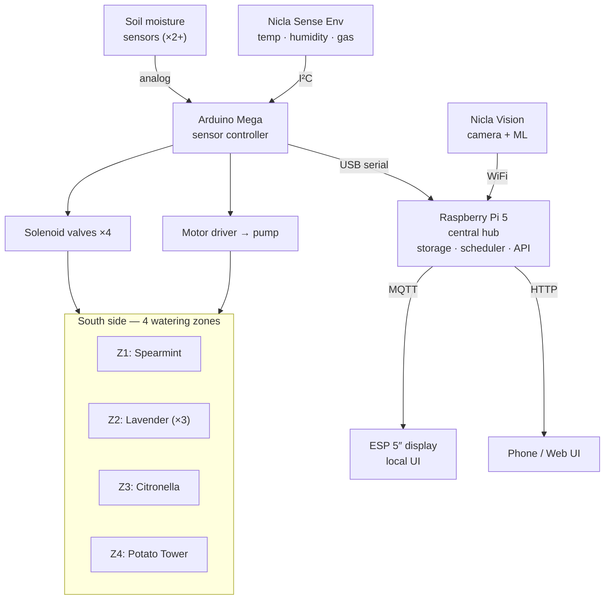

> How all the hardware and software connects in [[Garden Monitor]].

---

## Architecture Documents

- **[[Outdoor Watering System]]** — Detailed 4-zone irrigation design with per-plant watering profiles, sensor allocation, firmware logic, physical layout, and Houston-specific considerations
- **This page** — Overall system connectivity and communication

---

## High-Level Overview

---

## Communication Protocols

| From | To | Protocol | Data |
|------|----|----------|------|
| Soil Moisture Sensors | [[Arduino Mega]] | Analog wire | Voltage (moisture) |
| [[Arduino Nicla Sense Env]] | [[Arduino Mega]] | I2C | Temp, humidity, gas |
| [[Arduino Mega]] | [[Raspberry Pi 5]] | USB Serial (UART) | JSON sensor packets |
| [[Arduino Nicla Vision]] | [[Raspberry Pi 5]] | WiFi (HTTP/MQTT) | Images, health alerts |
| [[Raspberry Pi 5]] | [[Arduino Mega]] | USB Serial | Watering commands per zone |
| [[Raspberry Pi 5]] | [[ESP Display 5in]] | WiFi (MQTT) | Dashboard data |
| [[Raspberry Pi 5]] | Phone/PC | WiFi (HTTP) | Web dashboard |

---

## Data Flow

1. **Sense** — Soil moisture per zone (analog), temp/humidity/gas (I2C), soil temp (future DS18B20)
2. **Collect** — Arduino Mega polls sensors every 5 min, packages as JSON, sends over serial
3. **Process** — Pi 5 receives data, stores in DB, evaluates per-zone thresholds
4. **Act** — Per-zone watering decisions: open correct solenoid valve + run pump for zone-specific duration
5. **Display** — Dashboard updates on [[ESP Display 5in]] and/or web UI with per-zone status
6. **Alert** — Push notification if: pump failure, sensor offline, potato soil temp too high, reservoir low

---

## Resolved Questions

- [x] ~~MQTT vs REST for ESP Display~~ → MQTT (lightweight, real-time push updates)
- [x] ~~Where do Pi 1B boards fit~~ → Shelved for now, Pi 5 handles everything
- [x] ~~Keep GIGA Display Shield~~ → Shelved, [[ESP Display 5in]] is primary display (self-contained WiFi)
- [ ] Power plan for outdoor components → See [[Outdoor Watering System#Power Plan]]
- [ ] Weatherproofing strategy → IP65 junction box, cable glands, covered reservoir

---

**Links:** [[Garden Monitor]] · [[Outdoor Watering System]] · [[Hardware Inventory]]

#garden-monitor #architecture #planning
